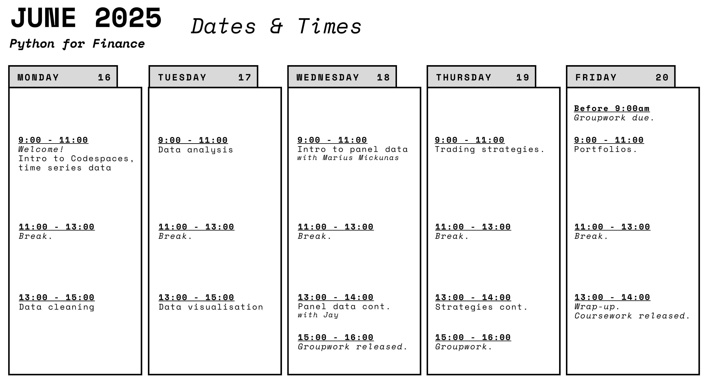

# Python for Finance

## Welcome to Python for Finance! 

- **Module Leader:** Jay DesLauriers
- **Teaching Assistant:** Marius Mickunas
- **MSc Management, IM, ESB**
- **June 2025**

### Module Outline

This module introduces the Python programming language as a tool to support financial and managerial decisions in business. Python has gained a reputation as one of the top choices for applying computational methods in finance because of its readability, portability, and rich third-party libraries. Throughout the module, students will apply Python to support financial and management decisions in business, with a focus on simplicity and practical applications. The module will focus on the application of Python for the preparation, analysis, and visualisation of financial data sets. Students will learn though domain-specific examples and learn how the Python libraries that support computational finance can be applied to gain insights that support business decision-making.

### Module Content

The module began with independent study of Python’s fundamentals through the Intro to Python primer. We explored data types and structures, and the basic syntax of the language. During the teaching week, students will write in Python, embrace best practices in coding and in documenting their work. Multi-purpose libraries (e.g., NumPy, pandas, Matplotlib) will be introduced for the preparation, analysis, and visualisation of financial time-series data and financial panel data. Data analysis will cover basic analytics and summary data, and students will implement and backtest different trading strategies. We will finish by looking at portfolio management and optimisation, giving students an end-to-end experience of using Python for Finance.

### Learning Outcomes

By the end of the module, you will be able to:

1. Code in Python, following best practices around clean coding, documentation, and style
2. Apply data cleaning and data preparation techniques to prepare a data set for analysis
3. Analyse financial time series data and other business data sets with Python and its libraries
4. Visualise data for presenting and sharing analyses in both print and digital formats
5. Use Python to support financial and management decisions in business

> Session are interactive, with instructor-led live coding. Students are encouraged to follow along and type code in real-time. **Laptop required.**

